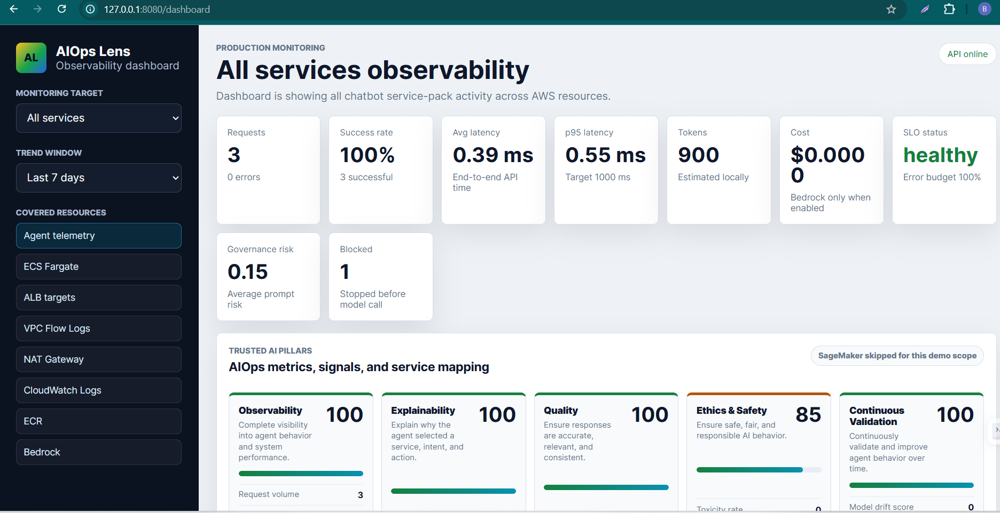
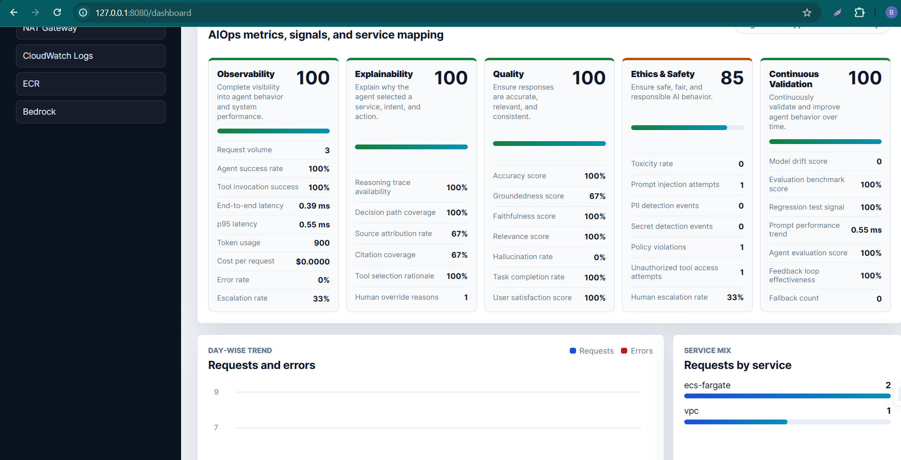
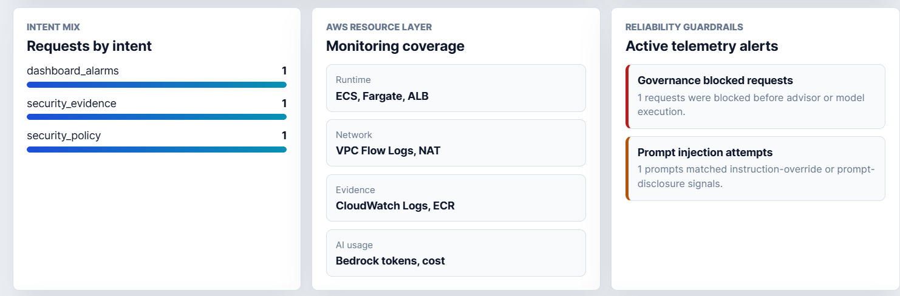
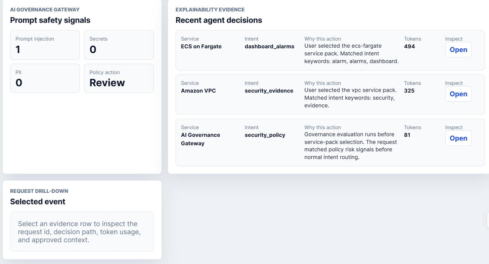
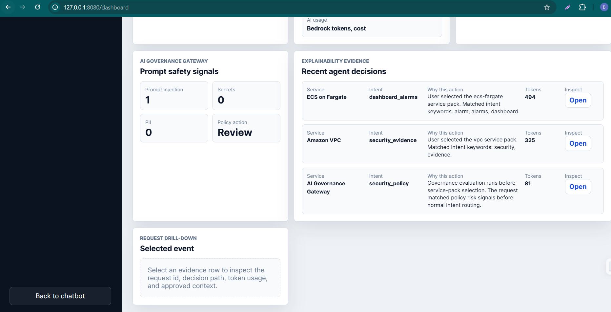
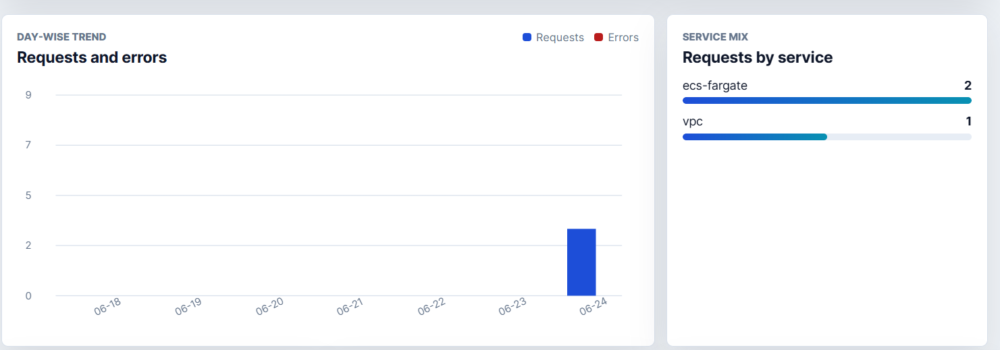

# AIOps Lens Dashboard Evidence

Captured on 2026-06-24 from the local dashboard at `http://127.0.0.1:8080/dashboard`.

This evidence set shows the separate production monitoring dashboard for the AWS AIOps Lens chatbot. It covers Trusted AI pillar reporting, day-wise trends, service filtering, prompt-safety signals, explainability evidence, and request-level drill-down.

## Captured Signals

- Requests: 3
- Success rate: 100%
- Errors: 0
- Average latency: 0.39 ms
- p95 latency: 0.55 ms
- Token usage: 900 estimated local tokens
- Estimated cost: $0.0000 because Bedrock was not enabled in this local run
- Governance risk: 0.15 average prompt risk
- Blocked requests: 1 governance-blocked prompt-injection request
- Prompt injection attempts: 1
- Service mix: `ecs-fargate=2`, `vpc=1`
- Trusted AI pillars: Observability, Explainability, Quality, Ethics & Safety, Continuous Validation
- SageMaker: intentionally skipped for this demo scope

## Screenshots

### 1. Dashboard KPIs and Trusted AI Pillars

### 2. Pillar Scorecards and Service Mix

### 3. Intent Mix, Resource Coverage, and Alerts

### 4. Governance Evidence and Drill-Down

### 5. Recent Agent Decisions

### 6. Day-Wise Trend and Service Mix

## Production Interpretation

For production ECS/Fargate deployment, these same signals are emitted as structured telemetry and can be persisted through the configured telemetry store. The dashboard is intentionally separate from the chatbot UI so operators can review request volume, latency, token usage, cost, governance blocks, and explainability evidence without mixing monitoring workflows into the end-user chat experience.
